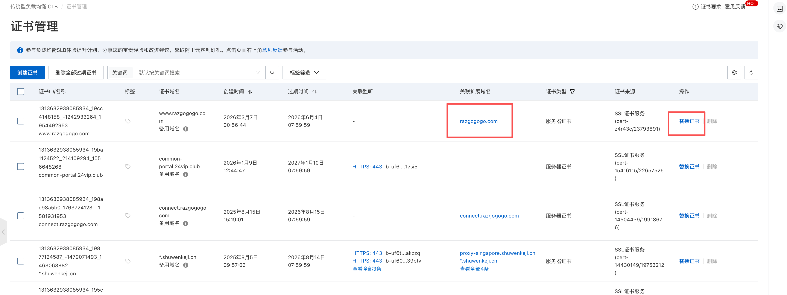
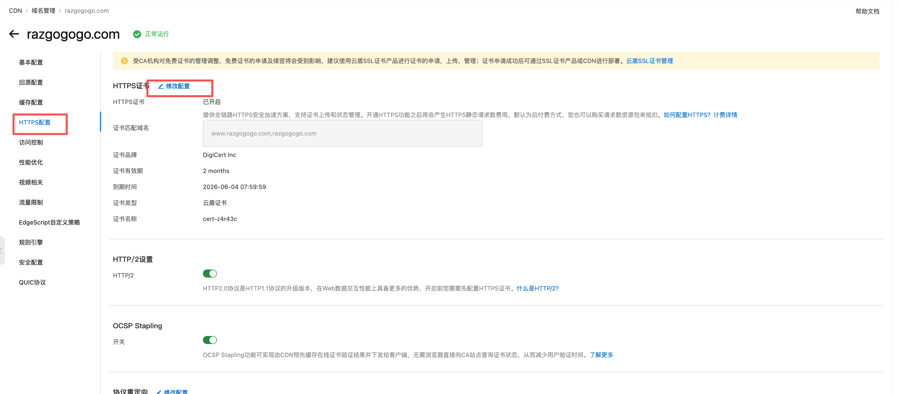

# How to setup HTTPS for your website?

## Get your SSL Certification

>     https://yundun.console.aliyun.com/

-   首先你需要购买证书
-   创建证书并签发，此处是会使用你购买的证书额度
    
-   等待签发完成，通常需要 10 分钟

## Setup in SLB

> https://slb.console.aliyun.com/  
> Slb to configure the corresponding forwarding rules and extended certificates

-   首先你需要在证书管理中手动同步证书到 SLB
    
-   配置你的 SLB 转发策略
    
    
-   配置扩展域名
    
    

## 替换证书
在 SLB 的证书管理中，选择替换证书，选择新的证书即可完成替换

在 CDN 中修改HTTPS证书

